# 이세계 쓱닷컴


## 1. 프로젝트 소개

### 🛒 프로젝트 개요

> 프로젝트 팀명 : 스파로스 4기 이세계 쓱닷컴
프로젝트 기간 : 2024.02.23 ~ 2024.04.17
> 
> 
> 프로젝트 소개 : 초기 기획부터 배포까지, A부터 Z까지 전 과정을 직접 개발한 쓱닷컴 클론 프로젝트
> 

[이세게쓱닷컴](https://m.isekai-ssg.shop/)


### 💻 기획 배경

현대적인 온라인 쇼핑 경험을 재현하고자 시작한 프로젝트로, 실제 시장에서의 요구사항을 분석하여 사용자 중심의 편리한 쇼핑 플랫폼 구축을 목표로 했습니다. 이 과정에서 실제 쇼핑몰 운영의 전 과정을 이해하고, 최신 기술을 적용해 보는 것이 주요 동기였습니다.

### 🥅 프로젝트 목표

본 프로젝트의 목표는 사용자에게 최적화된 쇼핑 경험을 제공하며, 효율적인 데이터 관리를 통해 상품 정보의 정확성과 신뢰성을 보장하는 것입니다. 또한, 직관적인 UI/UX 디자인을 통해 사용자 편의성을 극대화하고, 모든 개발 과정에서의 협업과 기술 스택의 최신성을 유지하여, 실제 업계 표준에 부합하는 프로젝트 구현을 목표로 합니다.

## 2. 기능 소개

### 🎈 기능 소개

1. 회원가입/로그인 : 회원가입/로그인, JWT 발급, 아이디 찾기, 비밀번호 재설정, 휴대폰인증(coolSMS 사용) 기능
2. 장바구니 : 회원/비회원 장바구니 기능. 비회원의 경우 쿠키를 발급하여 쿠키 value로 장바구니 관리.
비회원으로 장바구니 추가후 로그인시 담아뒀던 상품 회원 장바구니로 옮겨짐
3. 찜하기 : 단일상품, 특가, 브랜드, 카테고리 중, 소 찜하기 기능
4. 카테고리 : 카테고리별로 상품이 보여지고, 정렬기능과 필터링 기능 사용 가능
5. 검색 : 키워드 위주의 검색 기능
6. 구매 : 바로구매 및 장바구니 구매를 통해 상품 구매
7. 배송 : 배송 상태 확인
8. 리뷰 : 구매한 상품 리뷰 기능

### 🔎 화면별 기능 소개

- **메인페이지**


- **통합회원가입 및 간편회원가입**

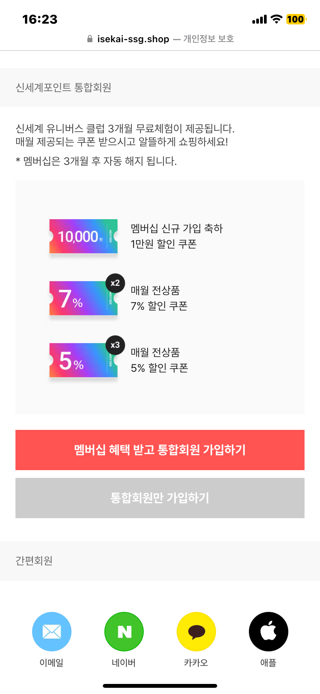

통합회원가입 또는 간편회원가입을 통해 회원가입을 진행합니다.

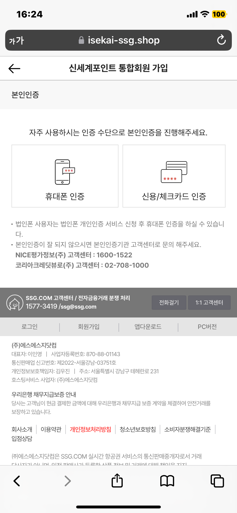

통합회원가입을 진행할 경우 휴대폰인증을 통해
회원가입이 가능합니다.

- **로그인**

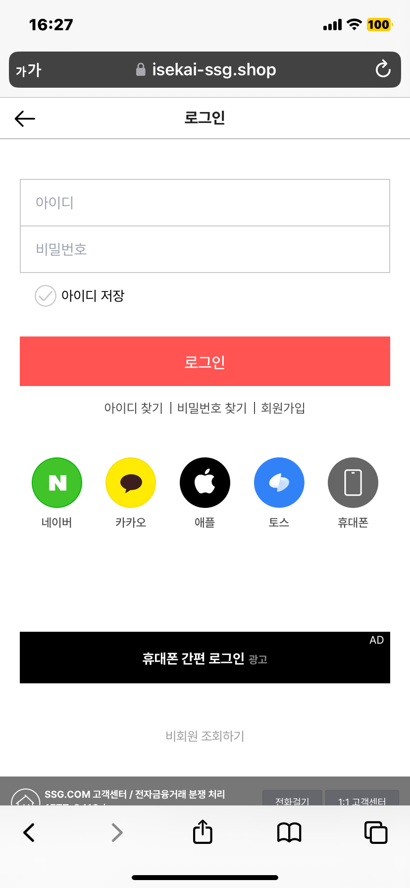

통합회원 또는 소셜회원으로 로그인을 합니다.

- **회원/비회원 장바구니**

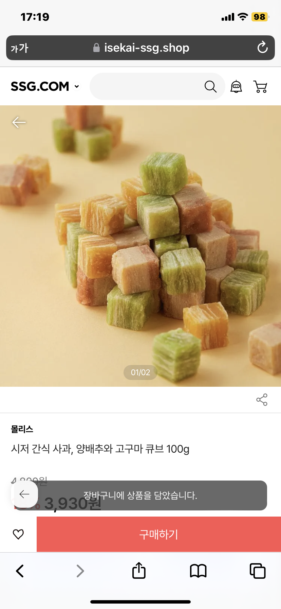

비회원으로 장바구니에 상품을 담습니다.

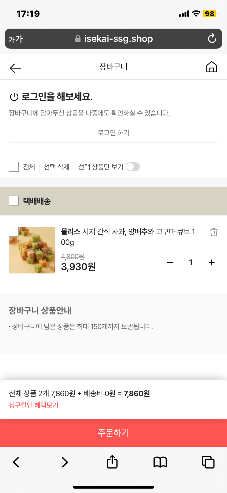

장바구니에 들어간 상품을 확인하고 로그인을 합니다.

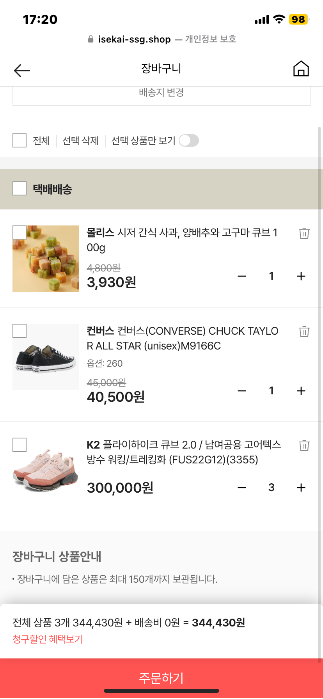

비회원으로 담은 장바구니
상품이 로그인 후 회원의 장바구니로 옮겨집니다.

- **찜하기**

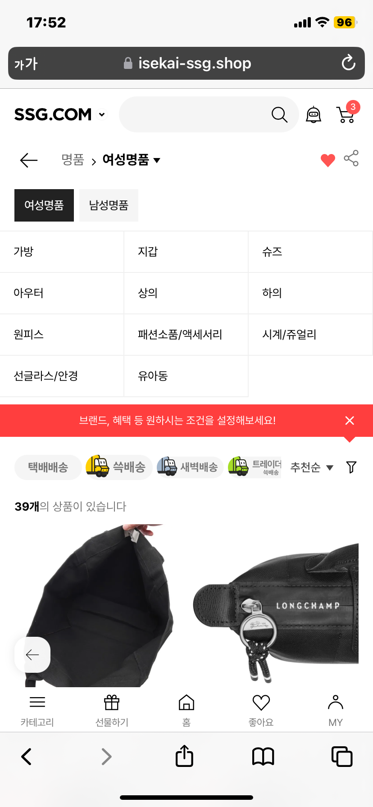

회원인 경우 자신이 좋아하는 카테고리를
찜 할 수 있습니다.


회원인 경우 자신이 좋아하는 상품을
찜 할 수 있습니다.

- **카테고리**


카테고리 대분류를 통해 원하는 카테고리를 선택합니다.

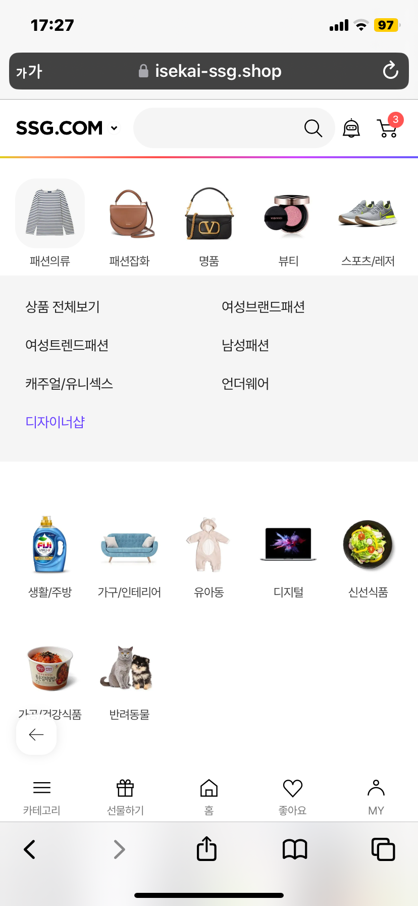

대분류를 선택하면 중분류
카테고리가 나오게 되고
그 중 관심있는 카테고리를
선택합니다.

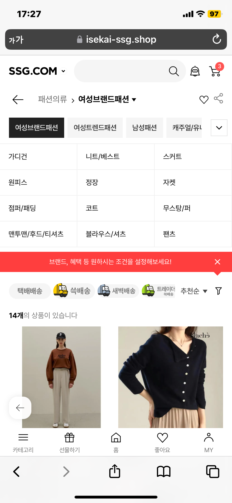

해당 카테고리의 상품들을
볼 수 있습니다. 정렬과 필터링을 통해 원하는 순서로
볼 수 있습니다.

- 검색

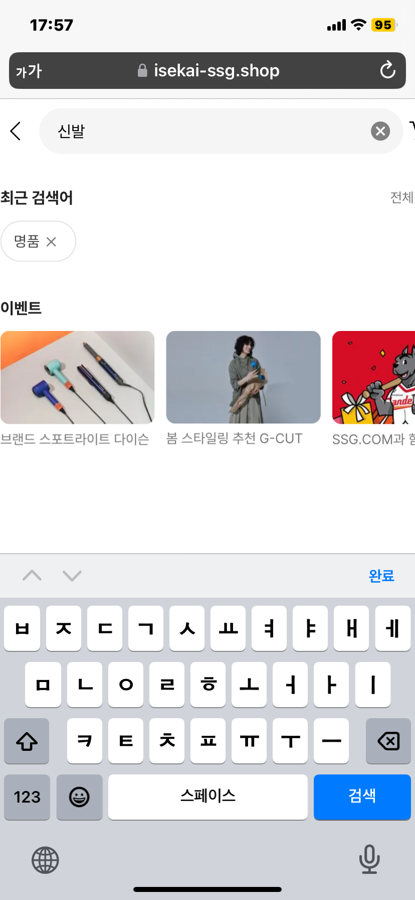

검색 기능을 통해 본인이 원하는 상품을 검색합니다.


검색 결과로 상품리스트를 볼 수 있습니다.

## 3. 개발 환경 및 사용 기술

### 🔨 개발 언어 및 도구

- **BE** `Spring boot(3.1.9)` **,** `IntelliJ(2023.2.5)`


- **FE** `TypeScript(5.1.3)`, `Visual Studio Code(1.84.2)`


- **공통**


### **🛠 사용한 라이브러리 및 프레임워크**

| 분류 | 기술 스택 |
| --- | --- |
| Common | GitHub, Notion, Discord, Figma, Git-Flow |
| Front-end | Next.js(v14.1.3), TypeScript(5.1.3), Node.js(20.11.1), npm(10.4.0) |
| Back-end | JDK(17), gradle(8.5), ORM (JPA), Spring Security, swagger(3) |
| CI/CD | AWS EC2, Nginx, Ubuntu(Ubuntu 20.04 LTS), Docker(25.0.4), Jenkins(2.440.1), Docker-compose(2.23.0) |
| Database | MySQL(8.0.36), Redis(7.2.4) |

### 🔧 **서버 구성 및 데이터베이스**

- 아키텍처 구조도

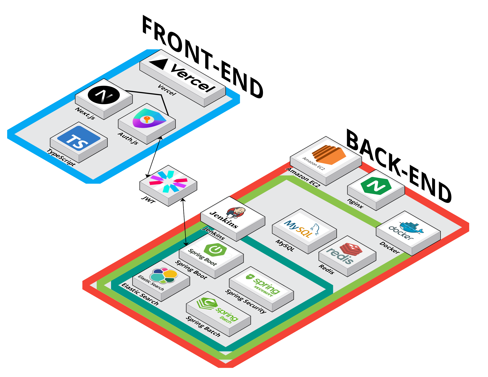

- ERD

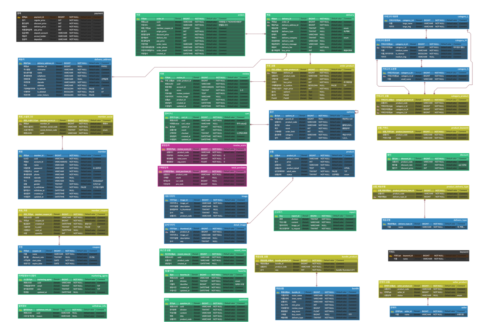

### **🗂️** Directory 구조도

- **BE**

```bash
📂src
    ├──📂main
    │   ├──📂generated
    │   │   └──📂com
    │   │       └──📂isekai
    │   │           └──📂ssgserver
    │   │               
    │   ├──📂java
    │   │   └──📂com
    │   │       └──📂isekai
    │   │           └──📂ssgserver
    │   │               ├──📂bundle
    │   │               │   ├──📂controller
    │   │               │   ├──📂dto
    │   │               │   ├──📂entity
    │   │               │   ├──📂enums
    │   │               │   ├──📂repository
    │   │               │   └──📂service
    │   │               ├──📂cart
    │   │               │   ├──📂controller
    │   │               │   ├──📂dto
    │   │               │   ├──📂entity
    │   │               │   ├──📂repository
    │   │               │   └──📂service
    │   │               ├──📂category
    │   │               │   ├──📂controller
    │   │               │   ├──📂dto
    │   │               │   ├──📂entity
    │   │               │   ├──📂repository
    │   │               │   └──📂service
    │   │               ├──📂common
    │   │               │   └──📂dto
    │   │               ├──📂config
    │   │               │   └──📂aop
    │   │               ├──📂coupon
    │   │               │   └──📂entity
    │   │               ├──📂delivery
    │   │               │   ├──📂controller
    │   │               │   ├──📂dto
    │   │               │   ├──📂entity
    │   │               │   ├──📂enums
    │   │               │   ├──📂repository
    │   │               │   └──📂service
    │   │               ├──📂deliveryAddress
    │   │               │   ├──📂controller
    │   │               │   ├──📂dto
    │   │               │   ├──📂entity
    │   │               │   ├──📂repository
    │   │               │   └──📂service
    │   │               ├──📂exception
    │   │               │   ├──📂common
    │   │               │   ├──📂constants
    │   │               │   └──📂dto
    │   │               ├──📂image
    │   │               │   ├──📂controller
    │   │               │   ├──📂dto
    │   │               │   ├──📂entity
    │   │               │   ├──📂repository
    │   │               │   └──📂service
    │   │               ├──📂member
    │   │               │   ├──📂controller
    │   │               │   ├──📂dto
    │   │               │   ├──📂entity
    │   │               │   ├──📂enums
    │   │               │   ├──📂repository
    │   │               │   └──📂service
    │   │               ├──📂option
    │   │               │   ├──📂controller
    │   │               │   ├──📂dto
    │   │               │   ├──📂entity
    │   │               │   ├──📂repository
    │   │               │   └──📂service
    │   │               ├──📂order
    │   │               │   ├──📂controller
    │   │               │   ├──📂dto
    │   │               │   ├──📂entity
    │   │               │   ├──📂repository
    │   │               │   └──📂service
    │   │               ├──📂product
    │   │               │   ├──📂controller
    │   │               │   ├──📂dto
    │   │               │   ├──📂entity
    │   │               │   ├──📂enums
    │   │               │   ├──📂repository
    │   │               │   └──📂service
    │   │               ├──📂redis
    │   │               ├──📂report
    │   │               │   └──📂entity
    │   │               ├──📂review
    │   │               │   ├──📂controller
    │   │               │   ├──📂dto
    │   │               │   ├──📂entity
    │   │               │   ├──📂enums
    │   │               │   ├──📂repository
    │   │               │   └──📂service
    │   │               ├──📂s3
    │   │               │   ├──📂controller
    │   │               │   └──📂service
    │   │               ├──📂seller
    │   │               │   ├──📂controller
    │   │               │   ├──📂dto
    │   │               │   ├──📂entity
    │   │               │   ├──📂enums
    │   │               │   ├──📂repository
    │   │               │   └──📂service
    │   │               └──📂util
    │   │                   └──📂jwt
    │   └──📂resources
    └──📂test
```

- **FE**

```bash
📂public
|---📂images      # 정적 이미지 파일
|---📂svgs        # svg 파일
📂src
|---📂app         # 라우팅 관련 파일
|---📂components  # 공통 컴포넌트
|---📂containers  # 라우터 폴더 별 컨텐츠
|---📂hooks       # 공통 훅
|---📂states      # recoil atom 관련 파일
|---📂styles      # 스타일 시트 관련 공통 요소
|---📂types       # 타입 정의 파일
\---📂utils       # 유틸성 함수 및 API fetch 함수
		
```

## 4. 프로젝트 멤버

|   **Name**   |박준표|구희영|김관호|박하윤|장미림|
| :----------: | :-----: | :-----: | :-----: | :-----: | :-----:|
| **Position** |팀장 <br/> 프론트엔드 <br/> 백엔드|프론트엔드|백엔드|백엔드|백엔드|
|   **Git**    |[wnsvy7203](https://github.com/wnsvy7203)|[heeyoung](https://github.com/hi9900)|[KwanHoo](https://github.com/KwanHoo)|[hyoonpark](https://github.com/hyoonpark)|[mirimy97](https://github.com/mirimy97)|
